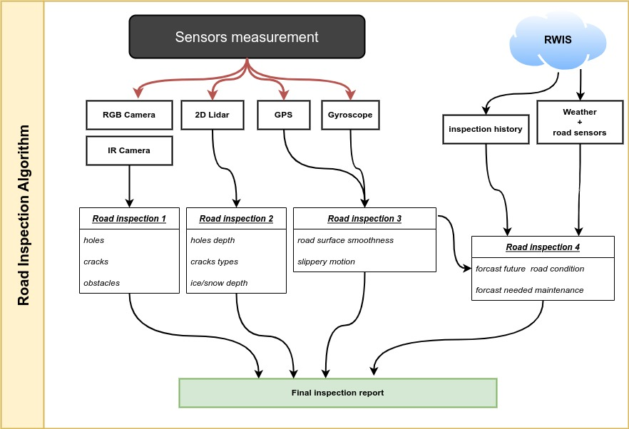

#  HAIS: Road Inspection Module  

The proposed road inspection solution is based computer vision and digital image processing technique. This algorithm   processes sensors data  and detects the potential road damages and conditions. The road inspection has two main steps:
## 1. HAIS inspection node
The system collects the road data (camera, LiDAR) using the inspection nodes mounted on a car as follows: 

<p align="center">

 </p>
<p align="center">
Figure: Illustration of the HAIS inspection nodes
</p>

##  2. HAIS GUI for road inspection
The system processes the different sensor data to generate an inspection report based computer vision and digital image processing technique. This algorithm   processes sensors data  and detects the potential road damages and conditions:
<p align="center">

</p>
<p align="center">
Figure: The road inspection algorithms flowchart
</p>


The use of different sensing technologies is pushing further research, industrial work to improve  the highways inspections by automating the inspection process, reducing the inspection duration, and participating in increasing the safety. 


# Installations
0. **Setup the Firebase storage**

https://console.firebase.google.com/u/0/

1. **install MySQL server**

```
$ sudo apt install mysql-server
```
Please setup a username and password of MySQL server :
-  [ MySQl tutorial](https://www.youtube.com/watch?v=TG6WAnyeDRw)
-  [  manage MySQL server](https://www.youtube.com/watch?v=TG6WAnyeDRw)
-  [create a password](https://linuxhint.com/change-mysql-root-password-ubuntu/)
- [SET PASSWORD Failed!](https://www.nixcraft.com/t/mysql-failed-error-set-password-has-no-significance-for-user-root-localhost-as-the-authentication-method-used-doesnt-store-authentication-data-in-the-mysql-server-please-consider-using-alter-user/4233)

```
$ sudo mysql_secure_installation
$ sudo service mysql status
$ sudo mysql -u root
$ sudo systemctl stop mysql.service

```
```
mysql> show databases;

```


2. **Setup the conda environment**
```
$  ../bash-scripts/build-anaconda-env.sh
```

3. **install additional packages**
-  [ffmpeg](https://ffmpeg.org/download.html)


# Running the Desktop application
1. **Run road inspection system**
```
$ ./run.sh
```

2. **Download the camera picture from Ontario511 platform**
```
$ ./bash-scripts/run_Ontario511_download.sh
```


#  Sample dataset 

 A sample data set can be downloaded from this Kaggle [link](https://www.kaggle.com/datasets/abderrazakchahid1/sample-data-hais).

```
kaggle datasets download -d abderrazakchahid1/sample-data-hais
```

# Acknowledgement

The proposed method used some other existing preprocessing packages which were adapted with/without modifications. The main resources are cited as follows:
* [PyQT5 image viewer](https://gist.github.com/acbetter/32c575803ec361c3e82064e60db4e3e0)
