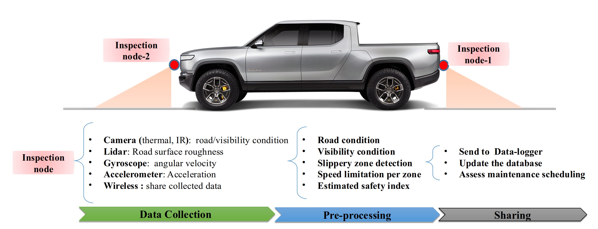

#  Highway Automated Inspection System (HAIS) 
The use of different sensing technologies is pushing futher research, industrial work to improve  the highways inspections by automating the inspection process, reducing the inspection duration, and participating in increasing the safety and . 
<p align="center">

 </p>
<p align="center">
Figure: Illustration of the HAIS-system
</p>


The proposed road inspection solution is based conputer vision and digital image processing technique. This algorithm   processes sensors data  and detects the potential road damages and conditions:
<p align="center">

Figue: The road inspection algorithms flowchart
</p>


# Instructions
1. **Setup the conda environment**
```
$ conda create -n hais-node-env python=3.7 conda -y 
$ conda activate hais-node-env
$ pip install -r setup-env/requirements.txt 
```
2. **install additional pachages**
-  [ffmpeg](https://ffmpeg.org/download.html)


3. **Run road inspection system**
```
./run.sh
```

# Data labeling
1. **manual data labeling**
```
$ run python

```
2. **copy existing labels** 
```
$ rsync -a --prune-empty-dirs --include '*/' --include '*.xml' --include '*.txt' --include '*.json' --exclude '*' source/ target/

```
# Project components
1. **Inspection node design**
get the sensors data and shared them on firebase
```
$ run python

```
2. **Box enclosure**
water-proof eclosure of the electronic devices nad inspection node.

2. **Drone control**
Integrate bridge inspection in drones with cameras

# Acknowledgement

The proposed method used some other existing preprocessing packages which were adapted with/without modifications. The main ressources are cited as follows:
* [PyQT5 image viewer](https://gist.github.com/acbetter/32c575803ec361c3e82064e60db4e3e0)