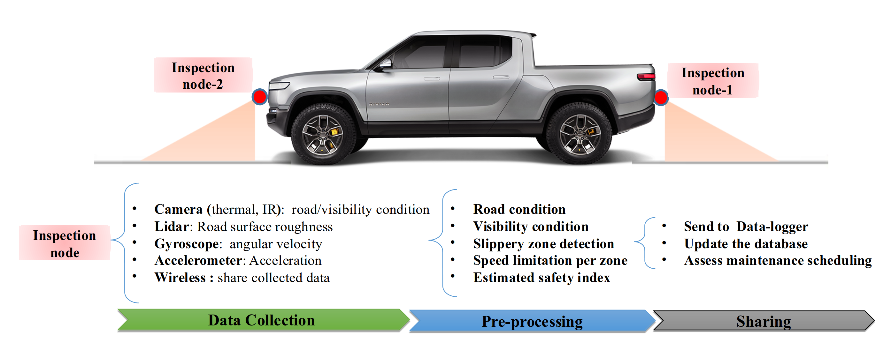
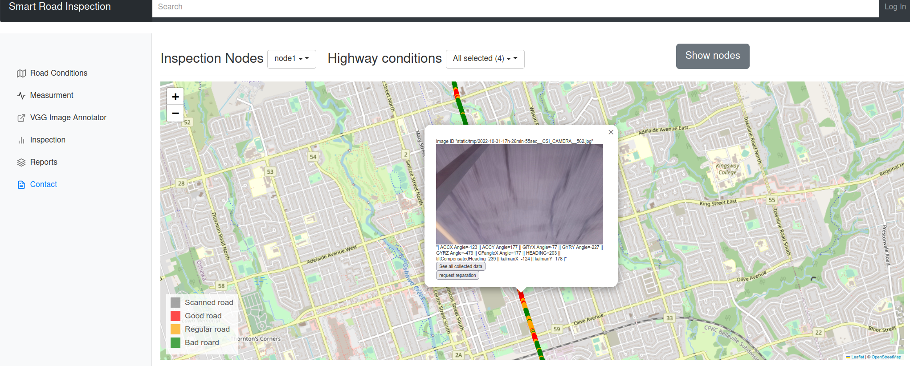
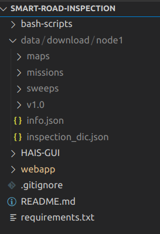

#  Highway Automated Inspection System (HAIS) 

The proposed road inspection solution is based computer vision and digital image processing technique. This algorithm   processes sensors data  and detects the potential road damages and conditions.
The HAIS project system is divided into three main modules:
## 1. HAIS inspection node
The system collects the road data (camera, LiDAR) using the inspection nodes mounted on a car as follows: 

<p align="center">

 </p>
<p align="center">
Figure: Illustration of the HAIS inspection nodes
</p>


##  2. HAIS GUI for road inspection [[link](HAIS-GUI/README.md)]
The system processes the different sensor data to generate an inspection report based computer vision and digital image processing technique. This algorithm   processes sensors data  and detects the potential road damages and conditions:
<p align="center">

</p>
<p align="center">
Figure: The road inspection algorithms flowchart
</p>


##   3. HAIS visualization  [[link](webapp/README.md)]

This project is the visualization of the HAIS-GUI inspection report using a webapp user interface
<p align="center">

 </p>
<p align="center">
Figure: Illustration of the HAIS visualization web server
</p>


#  Sample dataset 

 A sample data set can be downloaded from this Kaggle [link](https://www.kaggle.com/datasets/abderrazakchahid1/sample-data-hais).

```
kaggle datasets download -d abderrazakchahid1/sample-data-hais
```

**NB** : Please make sure you extract the downloaded zip file to the in the root folder:
<p align="center">

 </p>
<p align="center">
Figure: folder structure after extracting the data
</p>

# Acknowledgement

The work in the result of the research work supported by the Ministry of Transportation (MTO). The authors would like to thank the students who participated in different phases of the project development and testing: Muhammad Idrees helped with the sensors assembly and the setup of the Jetson Nano, and he initiated the ROS programming. Elena Villalobos Herra helped with the data collection process.
For more details about the research team, please refer to the published [paper](https://www.mdpi.com/2227-7080/11/2/51 ).

The proposed method used some other existing preprocessing packages which were adapted with/without modifications. The main resources are cited as follows:
*  [PyQT5 image viewer](https://gist.github.com/acbetter/32c575803ec361c3e82064e60db4e3e0)