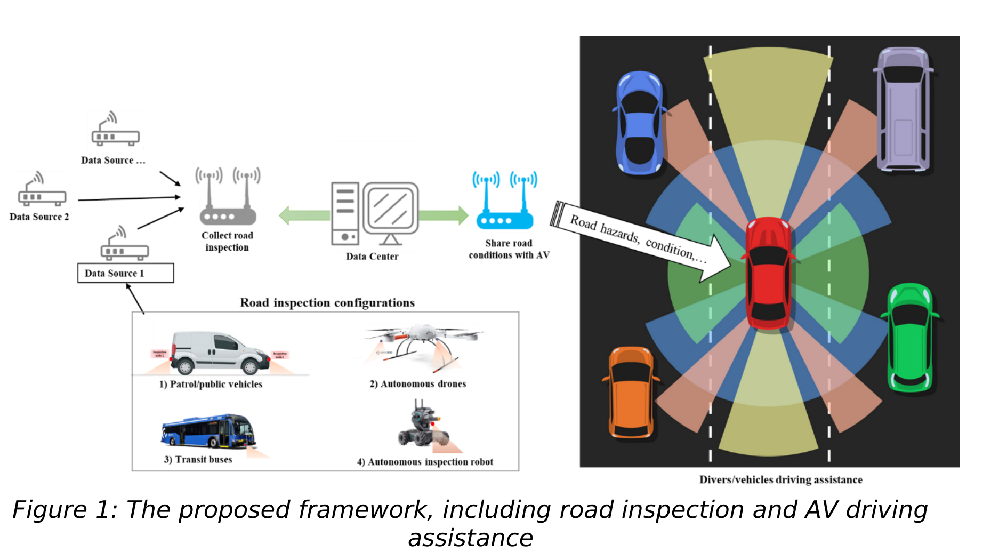

# Smart Road Inspection
The use of AI for raod inspection using drone and cars. 

<p align="center">

 </p>
<p align="center">

</p>


# Project components
1. Inspection node design
get the sensors data and shared them on firebase
```
$ run python

```
2. Box enclosure
water-proof eclosure of the electronic devices nad inspectin node.

2. Drone control
INtegrate bridge inspection in drones with cameras


# Acknowledgement

The proposed method used some other existing preprocessing packages which were adapted with/without modifications. The main ressources are cited as follows:
*  [.... ](https://github.com)
