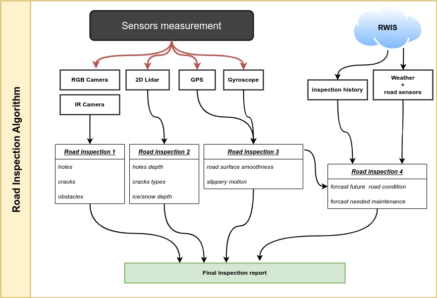

#  HAIS: Visualization of the Inspection Report 

This project is the visualization of the HAIS-GUI inspection report using a webapp user interface
<p align="center">

 </p>
<p align="center">
Figure: Illustration of the HAIS visualization web server
</p>

The HAIS-GUI processed the data collected using the inspection nodes mounted on a car as follows: 

<p align="center">

 </p>
<p align="center">
Figure: Illustration of the HAIS-system
</p>


The proposed road inspection solution is based computer vision and digital image processing technique. This algorithm   processes sensors data  and detects the potential road damages and conditions:
<p align="center">

</p>
<p align="center">
Figure: The road inspection algorithms flowchart
</p>

The use of different sensing technologies is pushing further research, industrial work to improve  the highways inspections by automating the inspection process, reducing the inspection duration, and participating in increasing the safety. 

# Installations
1. **Setup the conda environment**
```
$ .bash setup-env.sh 
```

# Instructions
1. **Run road inspection system**
```
$ ./run.sh
```
